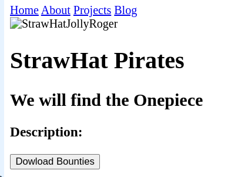

# Q1. Class-1: A1. Creating header section

#### Raw Problem
Create a simple Nav bar and Header section with just using plain HTML.

For the nav bar:
1. Use `<a>` tags to add the redirectable links.

*For the header section:*
1. Use `` tag to add a person's image.
2. Use Heading tags to add the name and summary/title.
3. Use the Button tag to add a button to download the resume.

Further, refer to the test cases to understand necessary requirements to submit the problem.
Below is the basic structure of the expected output:


```html
<!DOCTYPE html>
<!-- Please NOTE that the link to assets (like images) need to be set in global context.
For example:
To access an image from assets folder correct way to set src attribute is 

src = 'profile.png'

instead of 

src = './assets/profile.png'
-->
<html>
    <head>
        <title>
            Wannabe Developers
        </title>
    </head>
    <body>
        <section>
            
            <h1>I am Anant Shukla</h1>
            <h3>I am learning Web Dev</h3>
            <p>konnichiwa yoroshiku onegaishimasu!
                ore wa Anant Shukla, watashi wa Scaler School of Technology no gakusei desu.
            </p>
            <a href="#"></a>
        </section>
    </body>
</html>
```

### Output:


